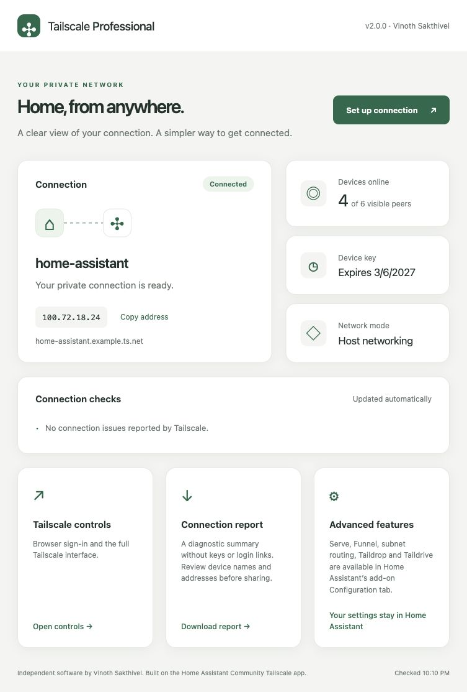

# Tailscale Professional

Securely connect your Home Assistant instance to your Tailscale network.

**Maintainer:** Vinoth Sakthivel · **Version:** 2.0.0 · **License:** MIT

A Tailscale add-on with a simple connection dashboard and guided setup. It
incorporates the networking features of the Home Assistant Community Tailscale
app, with attribution, and adds optional auth-key enrollment and safe diagnostic
exports. This is an independent project, not an official Tailscale product.

## Install

Add this repository in **Settings → Apps / Add-ons → Store → Repositories**:

```text
https://github.com/KANDIYARR/Tailscale
```

Install **Tailscale Professional**, start it, and choose **Open Web UI**.
Use **Set up connection** to name your device and select network preferences.
Use an authentication key or open **Tailscale controls** for browser sign-in.

Only `amd64` and `aarch64` are supported by this release, matching the current
community app. The legacy `armv7` entry from 1.0.0 has been removed.

## Dashboard preview

The screenshots use fictional connection data.



## Included features

| Networking foundation | Professional additions |
| --- | --- |
| MagicDNS and host DNS integration | Responsive light/dark dashboard |
| Subnet routes, exit nodes and app connector | Three-step guided setup |
| Serve, Funnel and Tailscale Services | Optional auth-key enrollment |
| Taildrop and Taildrive | Device name and connection overview |
| Custom control server / Headscale | Credential-free diagnostic export |
| Userspace networking and DERP preference | Setup validation and stale-edit protection |
| Health checks and network route protection | Migration from 1.0.0 options and state |

All advanced features remain available in Home Assistant's Configuration tab.
The native Tailscale web interface remains accessible from the dashboard.

## Upgrade from 1.0.0

Back up the add-on before upgrading. State remains at
`/config/tailscale/tailscaled.state`, preserving the enrolled identity. The old
`extra_args` values for managed options are migrated to dedicated settings.
Version 2 uses S6 Overlay v3 services and a community base image to support the
full networking stack.

Full feature parity adds `NET_RAW`, `SYS_ADMIN`, host D-Bus access and directory
mounts for Taildrive. Shares and public Funnel exposure remain disabled by
default. Review the [configuration and permissions](tailscale_professional/DOCS.md).

## Verification

CI runs unit and HTTP integration tests, configuration and S6 checks, and native
Docker builds for both architectures. Container checks cover Tailscale, the
Python service and nginx configuration. These do not replace testing on a real
Home Assistant host; see the [release checklist](docs/RELEASE_CHECKLIST.md).

[Feature mapping](docs/FEATURE_PARITY.md) · [Changelog](tailscale_professional/CHANGELOG.md)
· [Attribution](NOTICE.md) · [Security policy](SECURITY.md)
